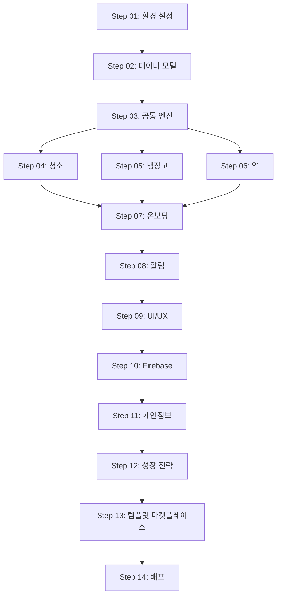

# 다정한 프롬프트 전체 분석 및 개선 제안서

날짜: 2026-04-12  
분석 대상: Step 00~14 (총 15개 프롬프트)

---

## 📊 발견된 문제점

### 🚨 **심각 (Critical)** - 즉시 수정 필요

#### 1. **Step 순서 번호 불일치**

**문제**: 템플릿 마켓플레이스 추가 후 일부 파일의 순서 번호가 업데이트되지 않음

| 파일 | 현재 표기 | 올바른 표기 |
|------|----------|------------|
| `step-01-project-setup.md` | Step 01/13 | Step 01/15 |
| `step-03-core-engines.md` | Step 03/13 | Step 03/15 |
| `step-04-cleaning-module.md` | Step 04/13 | Step 04/15 |
| `step-05-fridge-module.md` | Step 05/13 | Step 05/15 |
| `step-06-medicine-module.md` | Step 06/13 | Step 06/15 |
| `step-07-onboarding.md` | Step 07/13 | Step 07/15 |
| `step-08-notifications.md` | Step 08/13 | Step 08/15 |
| `step-09-ui-ux.md` | Step 09/13 | Step 09/15 |
| `step-11-privacy-legal.md` | Step 11/13 | Step 11/15 |
| `step-12-growth-strategy.md` | Step 12/13 | Step 12/15 |
| `step-13-deployment.md` | Step 13/13 (최종) | Step 13/15 |

**영향**: 사용자가 전체 진행도를 오해할 수 있음

**해결**: 모든 파일의 `**순서**: Step XX/13` → `Step XX/15` 일괄 변경

---

#### 2. **Step 13 의존성 불일치**

**문제**: `step-13-deployment.md`에 Step 14 의존성 누락

```markdown
현재: Step 01~12 모두 완료 필수
올바름: Step 01~12, 14 모두 완료 필수
```

**이유**: 템플릿 마켓플레이스(Step 14)는 Step 13 배포 전에 완료되어야 함

**해결**: step-13-deployment.md의 의존성 섹션 수정

---

### ⚠️ **중간 (Medium)** - 개선 권장

#### 3. **Phase 5 순서 혼란**

**문제**: Step 13과 14의 실행 순서가 명확하지 않음

현재 README/FLOWCHART:
```
Step 11 → Step 12 → Step 14 → Step 13
```

하지만 일부 사용자는 "Step 13이 최종"이라고 오해 가능

**제안**:
- **옵션 A (권장)**: Step 번호 재정렬
  - Step 13 → Step 14 (배포)
  - Step 14 → Step 13 (템플릿 마켓플레이스)
  - 이유: 숫자 순서가 실행 순서와 일치

- **옵션 B**: 명확한 설명 추가
  - 각 파일 상단에 "⚠️ 주의: Step 14 완료 후 진행" 경고 추가

**영향**: 사용자가 순서를 잘못 이해하여 배포 먼저 시도할 수 있음

---

#### 4. **템플릿 마켓플레이스 누락 참조**

**문제**: Step 04~06에서 템플릿 공유 기능 언급 없음

청소/냉장고/약 모듈은 템플릿으로 공유될 수 있는데, 해당 모듈 프롬프트에 이 내용이 없음

**제안**: 각 모듈 프롬프트 끝에 추가
```markdown
## 템플릿 공유 준비

이 모듈의 테스크는 Step 14에서 템플릿으로 공유할 수 있습니다.
- 테스크 데이터는 userId, id, nextDue를 제외하고 저장
- 템플릿 적용 시 새로운 ID 생성
```

---

#### 5. **Step 00 활용도 낮음**

**문제**: `step-00-dependencies-guide.md`가 참조되지 않음

Step 01에서 "사전 요구사항"을 직접 설명하고 있어 Step 00의 존재 의미가 약함

**제안**:
- **옵션 A**: Step 00 삭제하고 내용을 README로 이동
- **옵션 B**: Step 00을 "트러블슈팅 가이드"로 전환
  - 각 Step에서 발생 가능한 오류와 해결책 모음
  - 버전 호환성 문제
  - 환경별 차이점 (Windows/Mac/Linux)

---

### ℹ️ **낮음 (Low)** - 선택적 개선

#### 6. **타입 정의 중복 가능성**

**문제**: Step 02와 Step 14에서 템플릿 타입을 각각 정의

```typescript
// step-02-data-models.md
export interface SharedTemplate { ... }

// step-14-template-marketplace.md
export interface SharedTemplate { ... }
```

**제안**: Step 14에 "Step 02 참조" 명시
```markdown
## 1. 데이터 모델

템플릿 타입은 **Step 02**에서 이미 정의되었습니다.
[step-02-data-models.md#템플릿-시스템-타입](./step-02-data-models.md#템플릿-시스템-타입)

여기서는 해당 타입을 활용하여 서비스를 구현합니다.
```

---

#### 7. **완료 기준 검증 방법 부족**

**문제**: 각 Step의 "완료 기준"은 있지만, 검증 방법이 명확하지 않음

예시 (step-04):
```markdown
현재: ✅ "10분 코스" 빠른 추천 알고리즘 작동
개선: ✅ "10분 코스" 빠른 추천 알고리즘 작동
      → 검증: 10분 코스 버튼 클릭 시 3~5개 테스크 표시
```

**제안**: 각 완료 기준에 검증 커맨드 또는 테스트 방법 추가

---

#### 8. **예상 시간의 불확실성**

**문제**: 개발자 수준에 따라 시간이 크게 달라질 수 있음

현재:
```markdown
예상 소요 시간: 1-2일
```

**제안**: 경험 수준별 시간 제시
```markdown
예상 소요 시간:
- 초급 (React Native 6개월 미만): 2-3일
- 중급 (React Native 1년 이상): 1-2일
- 고급 (React Native + Firebase 경력): 0.5-1일
```

---

## ✅ 잘된 점

### 1. **일관된 구조**
모든 프롬프트가 동일한 템플릿 사용:
- 📌 단계 정보
- 📋 완료 기준
- 핵심 개념
- 구현 가이드
- 테스트
- 문제 해결

### 2. **명확한 의존성**
각 Step이 어떤 Step 이후에 진행되어야 하는지 명시

### 3. **병렬 진행 가능성 표시**
Step 04~06이 병렬 가능하다는 것을 명확히 표시

### 4. **실용적인 코드 예시**
추상적 설명이 아닌 복사-붙여넣기 가능한 실제 코드 제공

### 5. **문제 해결 섹션**
예상 가능한 오류와 해결책 미리 제공

---

## 🎯 개선 방향 제안

### **1단계: 긴급 수정 (1시간)**

#### A. Step 번호 일괄 변경
- Step 01~13의 `/13` → `/15` 변경
- 자동화 스크립트:
```bash
find dajeonghan-prompts -name "*.md" -exec sed -i '' 's/Step \([0-9][0-9]\)\/13/Step \1\/15/g' {} +
```

#### B. Step 13 의존성 수정
```markdown
### 이전 단계 요구사항
- ✅ Step 01~12, 14 완료: 모든 단계
```

---

### **2단계: 구조 개선 (2-3시간)**

#### A. Step 순서 재정렬 (권장)

**현재**:
```
Step 11 → Step 12 → Step 14 (템플릿) → Step 13 (배포)
```

**제안**:
```
Step 11 → Step 12 → Step 13 (템플릿) → Step 14 (배포)
```

파일명 변경:
- `step-13-deployment.md` → `step-14-deployment.md`
- `step-14-template-marketplace.md` → `step-13-template-marketplace.md`

README/FLOWCHART도 함께 수정

#### B. 템플릿 참조 추가

Step 04~06 끝에 추가:
```markdown
## 💡 템플릿 공유 준비

이 모듈의 테스크는 **Step 14 (템플릿 마켓플레이스)**에서 
다른 사용자와 공유할 수 있습니다.

템플릿으로 저장 시:
- `userId`, `id`, `nextDue` 필드는 제외됩니다
- 템플릿 적용 시 새로운 ID가 생성됩니다
- 공개/비공개 설정 가능

자세한 내용은 [Step 14](./step-14-template-marketplace.md)를 참고하세요.
```

---

### **3단계: 콘텐츠 강화 (1일)**

#### A. Step 00 재작성

**현재**: 기본적인 의존성 가이드
**제안**: 종합 트러블슈팅 가이드

```markdown
# Step 00. 트러블슈팅 가이드

## 환경별 문제 해결

### macOS
- M1/M2 칩 관련 이슈
- Xcode 버전 호환성

### Windows
- WSL2 설정
- Android Studio 경로 문제

### Linux
- 권한 문제
- 환경 변수 설정

## 자주 발생하는 오류

### Firebase 관련
- "Default app not initialized"
- "Permission denied"

### Expo 관련
- "Metro bundler failed"
- "Unable to resolve module"

### React Native 관련
- "Invariant Violation"
- "Cannot read property of undefined"

## 버전 호환성 매트릭스
[표 형식으로 정리]
```

#### B. 완료 기준 검증 방법 추가

각 Step의 완료 기준에 검증 방법 추가:

```markdown
## 📋 완료 기준

### ✅ "10분 코스" 빠른 추천 알고리즘 작동
**검증 방법**:
1. 홈 화면에서 "10분 코스" 버튼 클릭
2. 3~5개 테스크 표시 확인
3. 각 테스크의 `estimatedMinutes` 합계가 10분 이하인지 확인
```

#### C. 개발자 수준별 예상 시간 제공

```markdown
**예상 소요 시간**:
| 경험 수준 | 예상 시간 | 비고 |
|----------|-----------|------|
| 초급 (RN 6개월 미만) | 2-3일 | 튜토리얼 참고 필요 |
| 중급 (RN 1년 이상) | 1-2일 | 일부 개념 검색 필요 |
| 고급 (RN + Firebase 경력) | 0.5-1일 | 바로 구현 가능 |
```

---

### **4단계: 추가 리소스 (선택)**

#### A. 체크리스트 자동화 스크립트

`scripts/verify-completion.sh`:
```bash
#!/bin/bash
# Step 01 완료 확인
echo "Verifying Step 01..."
if npx expo start --help > /dev/null 2>&1; then
  echo "✅ Expo CLI 설치됨"
else
  echo "❌ Expo CLI 미설치"
  exit 1
fi
# ... 각 Step별 검증
```

#### B. 비주얼 플로우차트

Mermaid 또는 이미지로 전체 플로우 시각화:


#### C. 체크리스트 앱

간단한 웹 앱으로 진행도 추적:
```
https://dajeonghan-progress.netlify.app
- 각 Step 완료 체크
- 전체 진행률 표시
- 다음 해야 할 Step 하이라이트
```

---

## 📊 우선순위 매트릭스

| 개선 항목 | 영향도 | 난이도 | 우선순위 |
|---------|--------|--------|---------|
| Step 번호 일괄 변경 | 높음 | 낮음 | 🔴 P0 |
| Step 13 의존성 수정 | 높음 | 낮음 | 🔴 P0 |
| Step 순서 재정렬 | 중간 | 중간 | 🟡 P1 |
| 템플릿 참조 추가 | 중간 | 낮음 | 🟡 P1 |
| Step 00 재작성 | 중간 | 높음 | 🟢 P2 |
| 완료 기준 검증 추가 | 낮음 | 중간 | 🟢 P2 |
| 수준별 시간 제공 | 낮음 | 낮음 | ⚪ P3 |
| 자동화 스크립트 | 낮음 | 높음 | ⚪ P3 |

---

## 🚀 실행 계획

### Week 1: 긴급 수정
- [ ] Step 번호 `/13` → `/15` 일괄 변경
- [ ] Step 13 의존성에 Step 14 추가
- [ ] 변경사항 검증

### Week 2: 구조 개선
- [ ] Step 순서 재정렬 검토 (팀 논의)
- [ ] 재정렬 결정 시 파일명 변경 및 참조 업데이트
- [ ] Step 04~06에 템플릿 참조 추가

### Week 3: 콘텐츠 강화
- [ ] Step 00 트러블슈팅 가이드로 재작성
- [ ] 완료 기준에 검증 방법 추가
- [ ] 개발자 수준별 예상 시간 추가

### Week 4: 추가 리소스 (선택)
- [ ] 자동화 스크립트 작성
- [ ] 비주얼 플로우차트 생성
- [ ] 진행도 추적 도구 개발

---

## 📝 결론

### 현재 상태 평가: **85/100점**

**장점**:
- ✅ 일관된 구조
- ✅ 명확한 의존성
- ✅ 실용적인 코드 예시
- ✅ 포괄적인 커버리지

**개선 필요**:
- ❌ Step 번호 불일치 (긴급)
- ❌ Step 13 의존성 누락 (긴급)
- ⚠️ Step 순서 혼란 (중요)
- ⚠️ 템플릿 참조 부족 (중요)

### 권장 조치

**즉시 (이번 주)**:
1. Step 번호 `/13` → `/15` 일괄 변경
2. Step 13 의존성 수정

**단기 (2-3주)**:
3. Step 순서 재정렬 검토 및 적용
4. 템플릿 참조 추가

**중기 (1개월)**:
5. Step 00 트러블슈팅 가이드로 재작성
6. 완료 기준 검증 방법 추가

---

**작성자**: AI Assistant  
**날짜**: 2026-04-12  
**버전**: 1.0
